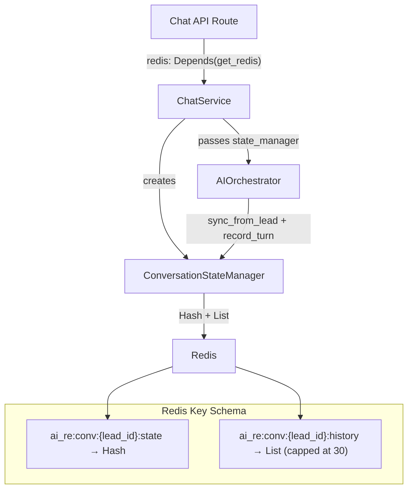

# AI State Manager & Redis Integration — Walkthrough

## Summary

Implemented a production-grade `ConversationStateManager` that uses Redis to track per-lead conversation state in real-time. The state manager is fully integrated across the backend stack — from the API route through to the AI orchestrator.

## What Changed

### New Files

| File | Purpose |
|---|---|
| [state_manager.py](file:///Users/abhishek0493/AI%20Real%20estate%20agent/backend/app/ai/orchestrator/state_manager.py) | Core `ConversationStateManager` class (~190 lines) |
| [test_state_manager.py](file:///Users/abhishek0493/AI%20Real%20estate%20agent/backend/tests/unit/test_state_manager.py) | 16 unit tests using fakeredis |
| [tests/unit/conftest.py](file:///Users/abhishek0493/AI%20Real%20estate%20agent/backend/tests/unit/conftest.py) | Minimal conftest for DB-free unit tests |

### Modified Files

| File | Change |
|---|---|
| [redis.py](file:///Users/abhishek0493/AI%20Real%20estate%20agent/backend/app/core/redis.py) | Added `get_redis_client()` (non-DI) + `close_redis()` shutdown helper |
| [config.py](file:///Users/abhishek0493/AI%20Real%20estate%20agent/backend/app/core/config.py) | Added `REDIS_STATE_TTL_SECONDS` (24h) + `REDIS_KEY_PREFIX` settings |
| [engine.py](file:///Users/abhishek0493/AI%20Real%20estate%20agent/backend/app/ai/orchestrator/engine.py) | Accepts optional `state_manager`; syncs state + records turns after tool execution |
| [chat_service.py](file:///Users/abhishek0493/AI%20Real%20estate%20agent/backend/app/services/chat_service.py) | Initializes state on cache miss; appends message summaries after commit |
| [chat.py](file:///Users/abhishek0493/AI%20Real%20estate%20agent/backend/app/api/v1/chat.py) | Injects Redis via `Depends(get_redis)` and passes to ChatService |
| [main.py](file:///Users/abhishek0493/AI%20Real%20estate%20agent/backend/app/main.py) | Calls `close_redis()` on shutdown |
| [conftest.py](file:///Users/abhishek0493/AI%20Real%20estate%20agent/backend/tests/conftest.py) | Made DB engine creation lazy (no longer fails at import without PostgreSQL) |
| [requirements.txt](file:///Users/abhishek0493/AI%20Real%20estate%20agent/backend/requirements.txt) | Added `fakeredis>=2.21.0` |

## Architecture



## Redis State Hash Fields

| Field | Description |
|---|---|
| `lead_id` | UUID string |
| `lead_status` | Current `LeadStatus` value |
| `lead_name` | Lead name |
| `preferred_location` | Collected location |
| `budget_min` / `budget_max` | Budget range (strings) |
| `bedrooms` | Number of bedrooms |
| `preferences` | JSON-encoded list |
| `turn_count` | Conversation turn counter |
| `last_tool` | Last tool executed |
| `last_tool_error` | Last tool error (if any) |
| `created_at` / `updated_at` | ISO timestamps |

## Key Design Decisions

1. **Opt-in pattern**: The state manager is optional everywhere. If Redis isn't available, the system falls back to PostgreSQL-only behavior with zero code changes.

2. **Non-critical Redis writes**: Message summary appends (step 8 in ChatService) are wrapped in try/except — Redis failures don't break the chat flow.

3. **Lazy test infra**: Made the test conftest's DB engine creation lazy so that Redis-only unit tests can run without PostgreSQL running.

4. **Pipeline batching**: All Redis operations use `pipeline()` to batch multiple commands into a single round-trip.

## Test Results

```
16 passed in 0.16s
```

All tests cover: initialize, get/sync state, record turns (with tool, without tool, with error), message summaries (append, capped list, truncation), delete/is_active, edge cases (minimal lead).
